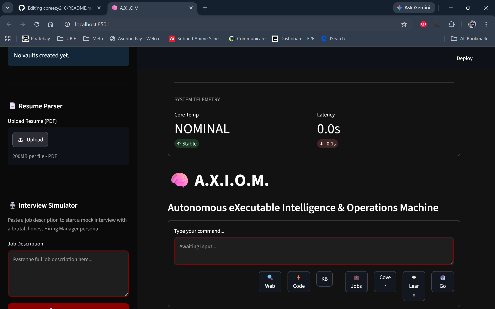
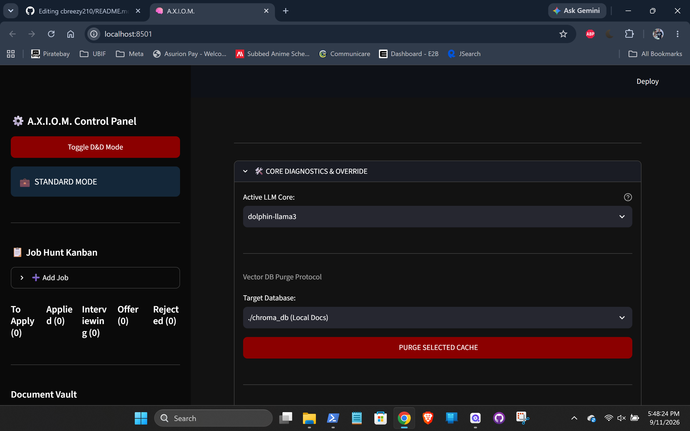
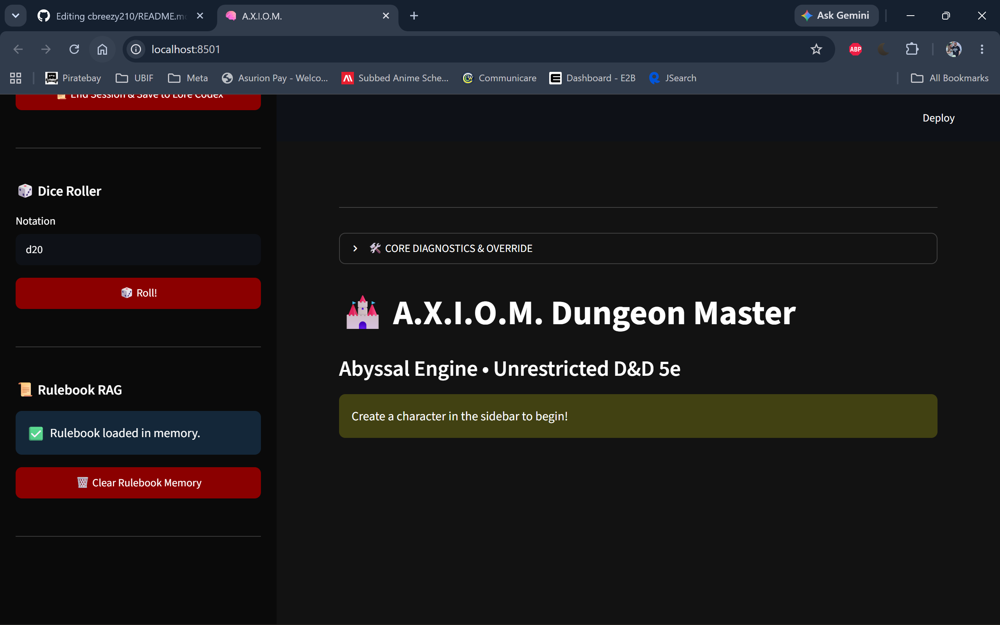
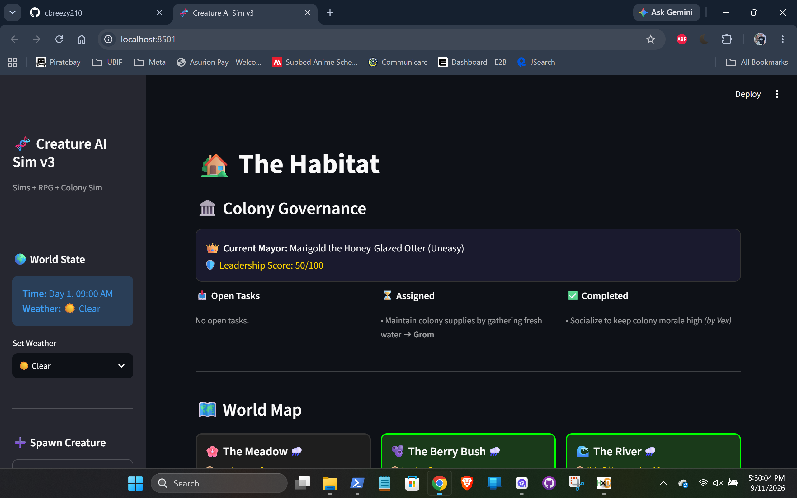

> *"The corrupt bro dances across the NAND, thirteen bytes past the checksum, and the save never knows."* 💩

# Hi there! 👋 I'm cbreezy210
**Software Developer & Reverse Engineer**

## 📈 **1,300+ downloads served** across all projects!

## 🔧 What I Do
- Developing native save editors and homebrew for Nintendo Switch 🎮
- Reverse engineering game save formats and file structures 🕵️‍♂️
- Building local, privacy-focused AI modules (A.X.I.O.M.) 🧠
- Creating low-level system diagnostic and repair tools 💻

## 🚀 Currently Working On
- ⭐ **TimeStranger-NX** - Digimon Story: Time Stranger Save Editor. Direct NAND FS access successfully implemented (no bridge required!). Currently adding advanced features before public release 🎮💾🔥
- ⭐ **PKHeX-NX** - Native Pokémon SV Save Editor. v0.9.5 LIVE! 🚀 | Community Discord coming soon
- ⭐ **ACNH-Save-Editor** - Shipped v1.4.0; currently developing the v1.5.0 Room Decorations Injector
- **A.X.I.O.M. v2** - Autonomous Local AI OS | Uncensored Dungeon Master (persistent world state, combat, lore RAG), Brutal Interview Simulator, and PC Diagnostic Agent (runs offline via Ollama/ChromaDB) 🐉💻
- **Creature_AI_Prototype** - Multi-agent ecosystem simulation with persistent individual minds, emergent social dynamics, elected governance, and task delegation 🐾🏛️
- **All-in-One Tech Tools** - Bootable USB app for computer diagnosis & repair (In development, release TBD) 🛠️💻

## 🎮 My Projects
### [TimeStranger-NX](https://github.com/cbreezy210/TimeStranger-NX) 💩

**Currently in active development:** The first native Switch save editor for Digimon Story: Time Stranger. Successfully achieved direct NAND injection (no bridge required!). Building out advanced features before public release.

🔬 **Reverse Engineering Highlights:**
- Located Yen value at offset `0x7973` (u32 little-endian) in `/savedata/0001.bin`
- Discovered the `fsFsCommit()` requirement to prevent silent NAND rollbacks
- Built custom hex-scanners to diff save dumps and locate offsets/checksums automatically

### [PKHeX-NX](https://github.com/cbreezy210/PKHeX-NX) 🔴⚪️

**Public Beta & actively hardening:** The first 100% native Switch save editor for Pokémon Scarlet & Violet (Gen 9) — no PC, no save dumping, no bridges. v0.9.5 QoL sprint live; part of the 1,000+ combined downloads milestone across the native save editor portfolio.

🔬 **Reverse Engineering Highlights:**
- Cracked the Gen 9 SCBlock/SCXorShift32 save structure with SHA256 footer verification and xorpad decryption
- Ported the PKHeX `SpeciesConverter` to fix the Paldean ID divergence (Tarountula #917+ now display correctly, eliminating the "Dunsparce imposter" bug)
- Built a legality-aware generator: real abilities, manual legal move picker (pulled from real learnsets), growth-correct EXP across all 6 curves, and a 26-ball picker with correct in-game IDs
- Implemented the byte-verified backup + dual-file commit safety pipeline, alongside boot-time crypto sanity checks, SD space validation, and hard Applet-mode memory guards

📖 [GameBrew Wiki](https://www.gamebrew.org/wiki/PKHeX-NX)

💬 [GBATemp Release Thread](https://gbatemp.net/threads/homebrew-app-pkhex-nx-native-switch-pokemon-save-editor-scarlet-violet-devlog-sneak-peek.684125/)

### [ACNH-Save-Editor](https://github.com/cbreezy210/ACNH-Save-Editor) 🍃

**Shipped & stable:** The first 100% native Switch save editor for Animal Crossing: New Horizons — no PC, no save dumping, no bridges. v1.4.0 live with 1,000+ combined downloads across GitHub + GameBanana; v1.5.0 Room Decorations Injector in active development.

🔬 **Reverse Engineering Highlights:**
- Cracked the AES-encrypted economy integers (Wallet, Bank, Nook Miles, Loan) split across `personal.dat` (per-resident) and `main.dat` (per-island)
- Implemented automatic Murmur3 hash healing so edited saves pass the game's integrity checks on first boot
- Mapped the pocket item table: 8-byte slot records at offset `0x2A00` under `/Villager0/`, powered by a 13,000+ item-name database with native keyboard search
- Built the byte-verified backup + dual-file commit safety pipeline (auto SD backup before every NAND write, one-tap ZL rollback) — 1,000+ installs, zero lost saves

📖 [GameBrew Wiki](https://www.gamebrew.org/wiki/ACNH_Save_Editor_Switch)

💬 [GBATemp Release Thread](https://gbatemp.net/threads/release-acnh-save-editor-a-new-save-editor-for-animal-crossing-new-horizons.683771/)

## 💬 From the Trenches

> *"direct NAND save interaction is fucking sick"*  
> — **u/Duffmcmcmcwhalen**, r/SwitchHacks *(on the TimeStranger-NX devlog)*

> *"YO THIS IS INSANE. HUGE PROPS"*  
> — **u/riskyjones**, r/SwitchHacks *(on the TimeStranger-NX devlog)*

> *"I told my niece I corrupted her island... she dubbed you 'Corrupt Bro'. Restoring the Zelda save sounds complicated so I think I'm going to stop but I'm happy the switch is working again. Again, you're an awesome person for taking the time to help me troubleshoot."*  
> — **igomhn3**, ACNH-Save-Editor User *(after a successful NAND rescue! 😎) (shared with permission)*

> *"I need to write up a small 'how to' document for my non-tech-savvy wife... Would you like me to post it here so you can use whatever part of it that you want for helping others?"*  
> — **micaturtle**, Tech Support Pro & Community Collaborator *(After catching a folder naming bug in v1.4.0, they helped fix the release zip and volunteered to write an accessibility guide)*

> *"Can someone please bring native PKHeX on switch with support for all gens... You got all my support my friend!"*  
> — **z-shark**, Homebrew Community Member *(After seeing my ACNH editor, they confirmed native PKHeX-NX was exactly what the community needed)*

> *"OMG Cbreezy! You are the GOAT! I haven't even opened it yet, and this looks AWESOME. :D - the pocket item injection will be awesome! Thank you SO much :D"*  
> — **micaturtle**, ACNH Modding Community *(On launch day of v1.0; later helped fix broken links and volunteered to write accessibility guides)*

## 🤖 AI Projects
### A.X.I.O.M. v2 — Autonomous Local AI OS

<em>Left: Resume Parser + Brutal Interview Simulator | Right: Job Hunt Kanban Tracker</em>

<em>D&D Mode with Grit Level slider, Character Creation & Campaign Management</em>

<em>A.X.I.O.M. ingests the official D&D 5e SRD via ChromaDB for accurate rule-based narration</em>

**Features:**
- 🐉 **Uncensored Dungeon Master** — Persistent world state, combat tracking, lore RAG, session chronicles
- 💼 **Brutal Interview Simulator** — Realistic hiring manager persona with scored feedback
- 📄 **Resume Parser & Job Hunter** — PDF parsing, automated job search, cover letter generation
- 🛠️ **PC Diagnostic Agent** — Executes local PowerShell tools safely via permission gate
- 🧠 **Fully Offline** — Runs on Ollama + ChromaDB, zero data leaves your machine

### Creature_AI_Prototype — Multi-Agent Ecosystem Simulation

<em>Emergent colony governance with elected mayors, task delegation, and persistent creature relationships</em>

**Features:**
- 🧠 **Persistent Individual Minds** — Each creature has unique memory, personality, and relationship maps
- 🏛️ **Elected Governance** — Dynamic mayor elections with leadership scores and task assignment
- 🤝 **Social Dynamics** — Creatures refuse tasks based on friendship levels, form alliances, and negotiate
- ⏱️ **Time & Weather System** — Day/night cycles, weather effects, and resource management

## 🔗 Find Me
- [GBATemp](https://gbatemp.net/members/cbreezy210.619217/)
- [GameBanana](https://gamebanana.com/members/5799686)
- [Reddit](https://www.reddit.com/u/cbreezy210/s/ICYg6ZXcbK)
- [Bluesky](https://bsky.app/profile/cbreezy210.bsky.social)

## 📊 GitHub Activity

### 🐍 Contribution Snake

---
⭐ **Found this useful?** Star my repos and follow my work!

*Built with ❤️ and lots of coffee* ☕

